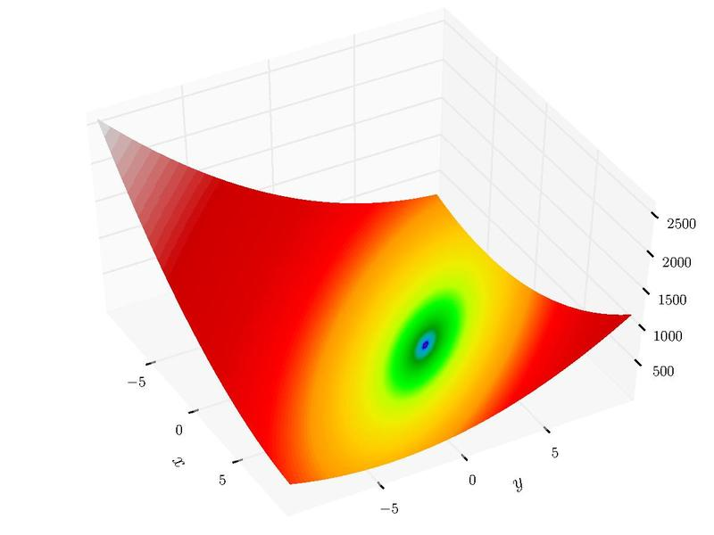

# Генетический алгоритм для поиска минимума функции
В качестве тестовой функции оптимизации была выбрана функция Бута

Графики изменения фитнесс функции с поколениями (начиная с нулевого и с пятого поколений)

Особенности реализации:
* Одноточечный кроссинговер
* Турнирная селекция
* Наличие элитных особей