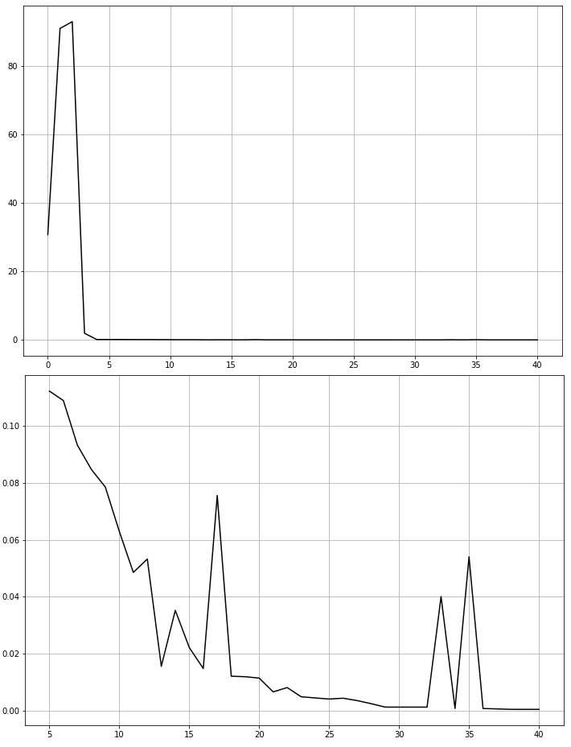
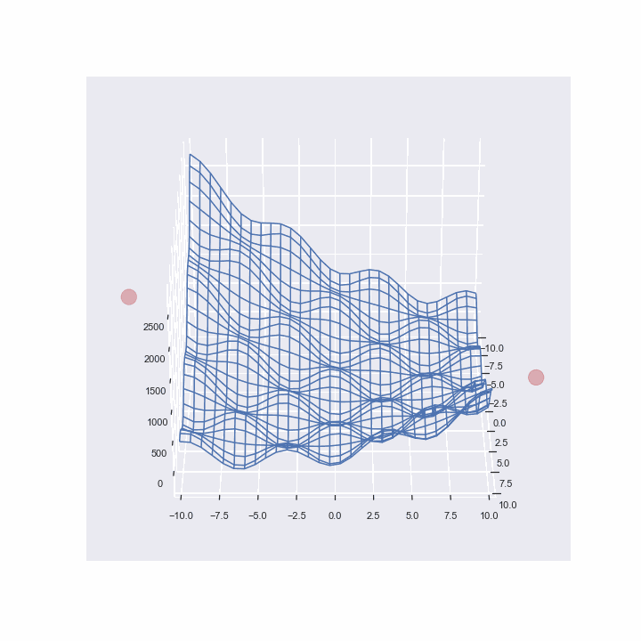

# Генетический алгоритм для поиска минимума функции
Графики изменения фитнесс функции с поколениями (начиная с нулевого и с пятого поколений)

Особенности реализации:
* Одноточечный кроссинговер
* Турнирная селекция
* Наличие элитных особей
